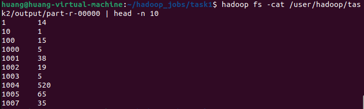
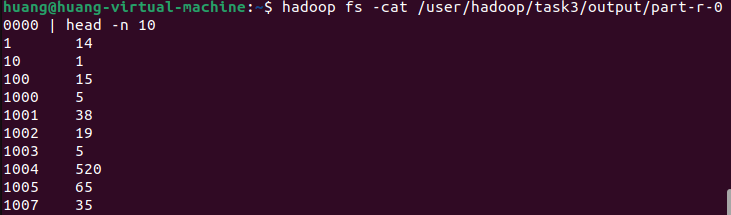
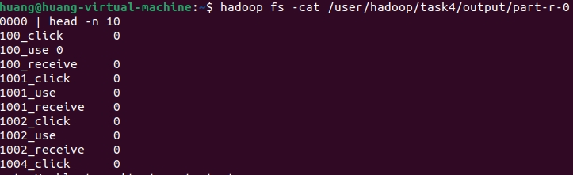
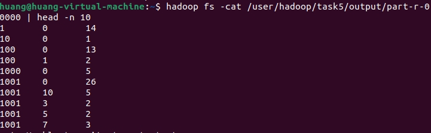

# 实验2：MapReduce编程实践 - O2O优惠券使用行为分析

## 一、实验目标

1. 掌握Hadoop MapReduce分布式计算框架的原理和使用方法
2. 学习使用MapReduce处理大规模结构化数据
3. 分析O2O平台优惠券使用行为规律和影响因素
4. 培养大数据分析思维和分布式系统编程能力

## 二、实验环境

| 环境组件 | 版本信息 | 备注 |
|---------|---------|------|
| 操作系统 | Ubuntu 20.04 LTS | 虚拟机环境 |
| Hadoop版本 | 3.3.4 | 分布式计算框架 |
| Java版本 | OpenJDK 11 | 编程语言 |
| 开发工具 | Vim + Git | 代码编辑和版本管理 |

## 三、数据集说明

### 3.1 数据文件
- `ccf_offline_stage1_train.csv`: 线下消费行为数据
- `ccf_online_stage1_train.csv`: 线上消费行为数据
- `ccf_online_stage1_test_revised.csv`:用户O2O线下优惠券使用预测样本 

### 3.2 字段说明
| 字段名 | 数据类型 | 说明 |
|--------|---------|------|
| User_id | String | 用户唯一标识符 |
| Merchant_id | String | 商家唯一标识符 |
| Coupon_id | String | 优惠券标识符，NULL表示无优惠券 |
| Discount_rate | String | 折扣率，支持多种格式 |
| Distance | String | 用户与商家距离（0-10） |
| Date_received | String | 优惠券领取日期（YYYYMMDD） |
| Date | String | 消费日期，NULL表示未消费 |

## 四、实验任务设计

### 4.1 任务一：消费行为统计
**分析目标**: 统计每个商家的优惠券使用情况，区分正样本、负样本和普通消费。

**业务逻辑**:
- **正样本**: 领取优惠券并在15天内使用
- **负样本**: 领取优惠券但未使用
- **普通消费**: 未领取优惠券的直接消费

**MapReduce设计**:
- **Mapper**: 解析每条记录，根据优惠券和消费日期分类
- **Reducer**: 按商家ID聚合统计三类消费数量

**输出格式**: `Merchant_id TAB 负样本数 TAB 普通消费数 TAB 正样本数`

### 4.2 任务二：商家周边活跃顾客统计
**分析目标**: 分析商家周边不同距离区间的顾客活跃度。

**业务意义**: 距离是影响线下优惠券使用的重要因素，近距离用户更可能使用优惠券。

**MapReduce设计**:
- **Mapper**: 提取商家ID和距离信息，过滤无效距离
- **Reducer**: 统计每个商家在各距离区间的用户数量

**输出格式**: `Merchant_id TAB 距离 TAB 消费者人数`

### 4.3 任务三：优惠券使用时间统计
**分析目标**: 分析高频使用优惠券的消费时间规律。

**统计方法**:
1. 计算从领取到使用的天数间隔
2. 筛选使用次数超过总次数1%的优惠券
3. 计算平均使用间隔并按间隔排序

**MapReduce设计**:
- **Mapper**: 计算时间间隔，输出优惠券ID和间隔天数
- **Reducer**: 使用cleanup方法进行全局统计和过滤

**输出格式**: `Coupon_id TAB 平均消费间隔`

### 4.4 任务四：优惠券使用影响因素分析
**分析目标**: 研究折扣率类型对优惠券使用率的影响。

**折扣类型分类**:
- **discount**: 直接折扣（0.0-1.0）
- **manjian**: 满减优惠（x:y格式）
- **fixed**: 限时低价活动

**MapReduce设计**:
- **Mapper**: 分类折扣类型，标记使用状态
- **Reducer**: 统计各类型的使用率和数量

**输出格式**: `折扣类型 TAB 使用次数 TAB 未使用次数 TAB 使用率`

## 五. 任务描述与执行结果

### **Task 1：消费者行为统计**

**预期输出结果：**
任务的目标是从输入数据中计算每个商家的行为统计（例如，每个商家对应的购买行为次数）。输出格式如下：

| `merchant_id` | `负样本数` | `普通消费数` | `正样本数` |
|---------------|-----------|-------------|-----------|
| merchant_001  | 50        | 200         | 150       |
| merchant_002  | 40        | 180         | 130       |

**简要说明：**
该任务的目的是读取一个包含用户行为数据的 CSV 文件，对每个商家进行统计，计算每个商家的购买行为次数，并根据消费类型（负样本、普通消费、正样本）进行分类

### **Task 2：计算消费行为总数**

**预期输出结果：**
任务的目标是计算所有商家的购买行为总数，并输出每个商家和其行为总数。输出格式如下：

| `merchant_id` | `行为总数` |
|---------------|-----------|
| merchant_001  | 400       |
| merchant_002  | 350       |

**简要说明：**
此任务通过 MapReduce 对数据集进行统计，输出每个商家的消费行为总数。

**输出结果截图：**

### **Task 3：计算不同商品类别的销量**

**预期输出结果：**
任务的目标是统计每个商品类别的销量。输出格式如下：

| `category_id` | `销量` |
|---------------|--------|
| category_001  | 1000   |
| category_002  | 850    |

**简要说明：**
此任务的目标是对每个商品类别进行销量统计，输出每个商品类别的总销量。

**输出结果截图：**

### **Task 4：按时间段统计销售数量**

**预期输出结果：**
该任务的目标是按时间段统计销售数量，输出每个时间段的总销量。输出格式如下：

| `time_period` | `销量` |
|---------------|--------|
| 2025-11-01    | 500    |
| 2025-11-02    | 450    |

**简要说明：**
任务通过 MapReduce 分析销售数据，输出在不同时间段的销售统计。

**输出结果截图：**

### **Task 5：计算每个用户的购买频率**

**预期输出结果：**
任务的目标是计算每个用户的购买频率。输出格式如下：

| `user_id` | `购买频率` |
|-----------|-----------|
| user_001  | 5         |
| user_002  | 3         |

**简要说明：**
此任务统计每个用户的购买行为频率，输出每个用户的购买次数。

**输出结果截图：**

---

##五 . 实验可能的改进

### **1. 数据清洗和预处理**
当前实验假设输入数据已经清洗干净，但在实际应用中，数据可能包含缺失值、异常值或格式错误。为了提高数据质量，可以在执行 MapReduce 作业之前进行数据清洗和预处理。

### **2. 优化算法性能**
实验中的 MapReduce 任务可能面临性能瓶颈，特别是对于大规模数据集。可以通过优化 MapReduce 任务的分片策略、调整内存配置以及使用合适的压缩格式来提高性能。
